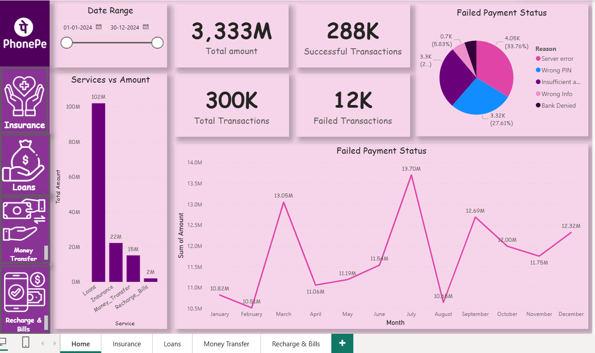

# 📊 PhonePe Insights – Power BI Dashboard

## 📌 Project Overview
The **PhonePe Insights Power BI Project** is an interactive data visualization solution designed to analyze digital payment trends on the PhonePe platform.  
The dashboard provides a comprehensive view of **transactions, amounts, success vs failure rates, and failure reasons** across multiple PhonePe services.

This project helps stakeholders understand:
- Transaction performance
- User payment behavior
- Service-wise contribution
- Payment failure patterns and trends

---

## 🛠 Tools & Technologies Used
- **Power BI Desktop**
- **DAX (Data Analysis Expressions)**
- **Power Query**
- **Data Modeling**
- **Interactive Visualizations**

---

## 📂 Dashboard Structure
The project consists of **five main report pages**, each focusing on a specific PhonePe service.

### 🏠 1. Home Dashboard
**Purpose:** Overall business performance snapshot

**Key Metrics:**
- Total Transaction Amount
- Total Transactions
- Successful Transactions
- Failed Transactions

**Visuals:**
- Service-wise Amount Comparison  
- Monthly Failed Transaction Trend  
- Failed Payment Reasons (Pie Chart)  
- Date Range Slicer for dynamic filtering  

---

### 🛡 2. Insurance Dashboard
**Purpose:** Analyze insurance-related transactions

**Key Insights:**
- Total Insurance Amount
- Successful vs Failed Payments
- Policy-wise Amount Distribution (Bike, Car, Health, Term Life)
- Monthly Premium Trend
- Failure Reasons Breakdown

---

### 💰 3. Loans Dashboard
**Purpose:** Loan transaction performance analysis

**Key Insights:**
- Total Loan Amount
- Loan Type Distribution (Gold Loan, Auto Loan, Mutual Fund, Credit Score)
- Monthly Loan Amount Trend
- Payment Success Rate
- Failure Reasons Analysis

---

### 🔄 4. Money Transfer Dashboard
**Purpose:** Track P2P and UPI-based transfers

**Key Insights:**
- Total Money Transferred
- Transaction Count
- Transfer Type Analysis (UPI ID, Self Account, QR Code, Mobile)
- Monthly Transfer Trend
- Payment Failure Reasons

---

### 📱 5. Recharge & Bills Dashboard
**Purpose:** Monitor bill payments and recharges

**Key Insights:**
- Recharge & Bill Payment Amount
- Transaction Success Ratio
- Monthly Spending Trend
- Failure Reason Distribution

---

## 📈 Key Features
- 📅 **Date Range Slicer** for time-based analysis  
- 🎯 **Service-wise Drilldowns**  
- 📊 **Dynamic KPIs & Cards**  
- 🔍 **Failure Reason Analysis**  
- 🎨 **Consistent UI Theme inspired by PhonePe branding**

---

## 📊 Business Insights Generated
- Over **95% transaction success rate** across services
- Server errors and incorrect PINs are top failure reasons
- Loans and Insurance contribute significantly to total transaction value
- Seasonal trends visible in monthly transaction amounts

---

## 📁 Dataset Information
- The dataset represents **simulated PhonePe transaction data**
- Includes:
  - Transaction ID
  - Date
  - Service Type
  - Amount
  - Payment Status
  - Failure Reason

---

## 📌 Future Enhancements
- Add State-wise & City-wise analysis
- Include Customer Demographics
- Build Predictive Failure Analysis
- Integrate Real-Time Data Source

---

## 👤 Author
**Ashik Kumar Ghosh**  
Power BI Developer | Data Analytics Enthusiast  

---

## ⭐ Acknowledgements
- PhonePe UI inspiration
- Power BI community resources
- Open-source learning materials
